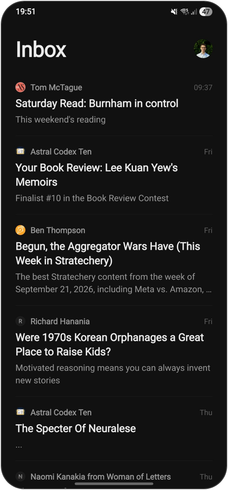
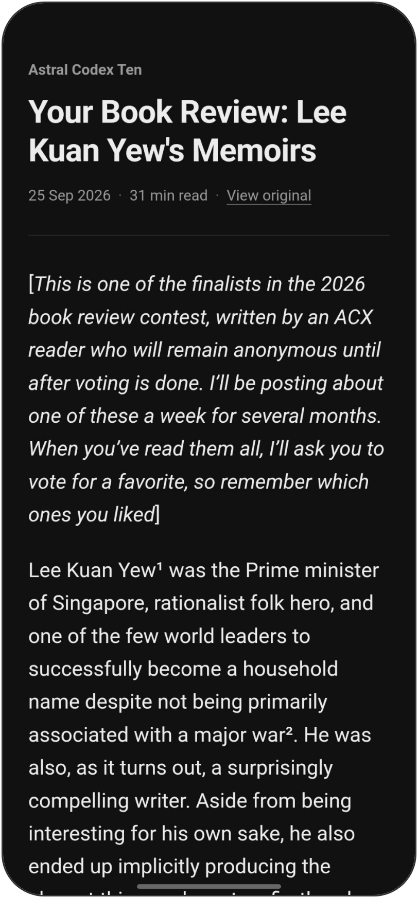
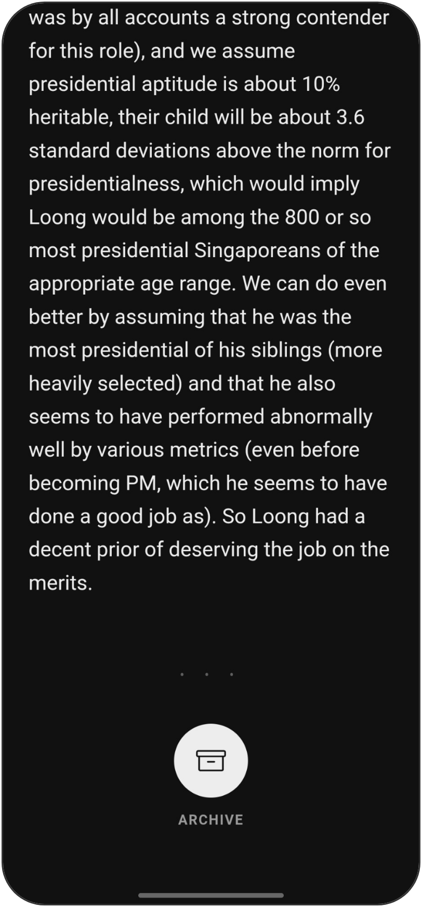

<div align="center">

<picture>
  <source media="(prefers-color-scheme: dark)" srcset="docs/logo-dark.svg">
  
</picture>

# Folio

**A quiet Gmail reader for newsletters.**<br>
No toolbars, no clipped messages, no inbox clutter: just the words.

[](https://github.com/bpiggin/folio/actions/workflows/build-apk.yml)
[](https://github.com/bpiggin/folio/releases/latest)

[](LICENSE)

<br>

&nbsp;&nbsp;
&nbsp;&nbsp;


</div>

---

Gmail is built for triage: replying, labelling, forwarding and moving on. It's a poor
place to read a 4,000-word essay. Long newsletters get cut off with *"[Message clipped]
View entire message"*, and the full version opens in a cramped web view. Toolbars take
up the top and bottom of the screen the whole time you're reading.

Folio does three things.

1. **Shows your inbox**, newest first. It doesn't track read or unread.
2. **Opens messages full screen**, with nothing but the text.
3. **Archives** a message from the end of it, or with a swipe in the inbox.

## Features

- **Never clipped.** Folio fetches the complete message from the Gmail API, however
  long it is. Gmail's ~102 KB cut-off doesn't apply.
- **Reader view.** Newsletters are reflowed into a single, comfortable column by
  [Mozilla Readability](https://github.com/mozilla/readability), the engine behind
  Firefox Reader View. It uses your phone's own sans-serif, as Substack does.
- **Original layout when it's better.** Link round-ups and heavily designed emails
  keep their own layout, scaled to fit your screen. One tap switches between the two views.
- **Proper dark mode.** Reader view follows the system theme. Original layouts are
  recoloured for dark mode: light backgrounds turn dark and dark text turns light,
  while brand colours and images stay intact.
- **Instant.** The inbox and every message in it are cached on your phone and
  downloaded in the background, so opening an email doesn't show a spinner.
- **Reading time.** Each message shows an estimate at the top.
- **Archive at the end, or with a swipe.** Scroll to the bottom and tap the archive
  button, or swipe a message left or right in the inbox. An *Undo* option appears
  briefly afterwards.
- **Small, monochrome and calm.** Screens fade in and out quickly. Each sender gets a
  small inline icon, and the whole app is black and white.

## Getting Folio on your phone

Folio isn't on the Play Store. You build your own copy on GitHub's servers, for free
and without installing Android Studio, then install the APK directly.

> **Why not just download the APK from this repo?** A Gmail app needs a Google
> Cloud project to sign in, and Google only lets a personal (unverified) project be
> used by accounts it lists as users. The builds on this repo's Releases page sign
> in through the maintainer's project, so they won't work for your account. Setting
> up your own takes about 15 minutes, and after that you own the whole thing.

### 1. Fork this repository

Click **Fork** at the top of this page. In your fork, open the **Actions** tab and
enable workflows. GitHub turns them off for new forks.

Then choose an Android package name that's unique to you, such as `com.yourname.folio`.
Add it under **Settings → Secrets and variables → Actions → Variables** as
`ANDROID_PACKAGE`.

### 2. Create a Google Cloud project

1. Go to the [Google Cloud console](https://console.cloud.google.com/) and **create a
   project**.
2. Under **APIs & Services → Library**, find the **Gmail API** and click **Enable**.
3. Open **Google Auth Platform** and click **Get started**. Name the app, give your
   email address as the contact, and choose **External** as the audience.
4. Under **Audience → Test users**, add your Gmail address.
5. Under **Clients → Create client**, choose **Android**:
   - **Package name:** the `ANDROID_PACKAGE` value you chose in step 1
   - **SHA-1 certificate fingerprint:**
     ```
     5E:8F:16:06:2E:A3:CD:2C:4A:0D:54:78:76:BA:A6:F3:8C:AB:F6:25
     ```
     This is the default signing key the build uses. Each build also prints the
     fingerprint in its log. See [Signing with your own key](#signing-with-your-own-key).

You don't need to add any client ID or secret to the code. Google recognises the app
from its package name and signature.

> [!TIP]
> While the project is in **Testing**, Google signs you out every 7 days. To stop
> this, go to **Audience** and click **Publish app**. For personal use you don't need
> to submit it for verification. When you connect, Google shows a *"Google hasn't
> verified this app"* screen. Tap **Advanced → Go to Folio** to continue: it's your
> own project.

### 3. Build and install

1. In your fork, go to **Actions → Build APK → Run workflow**. The build takes about
   12 minutes. Every later push to `main` also builds and publishes a new APK.
2. On your phone, open your fork's **Releases** page and tap **folio.apk**. Android
   asks you to allow installs from your browser the first time.
3. Open Folio and tap **Connect Gmail**.

To update, install a newer `folio.apk` over the old one. Your sign-in and cache are kept.

### Signing with your own key

By default the APK is signed with React Native's standard debug key. That's fine for
personal use, because Google still asks *you* to sign in and consent. Since that key is
public, you may prefer your own:

```sh
keytool -genkeypair -v -keystore folio.keystore -alias androiddebugkey \
  -storepass android -keypass android -keyalg RSA -keysize 2048 -validity 10000 \
  -dname "CN=Folio"
base64 -w0 folio.keystore          # macOS: base64 -i folio.keystore
keytool -list -v -keystore folio.keystore -storepass android | grep SHA1
```

Save the base64 output as the repository **secret** `ANDROID_KEYSTORE_BASE64`. Then
put the new SHA-1 on your Google Cloud Android client. Uninstall the old APK once
before installing: Android won't update an app that has changed signing keys.

## Privacy

- **There's no server.** Folio talks directly from your phone to the Gmail API. It
  has no analytics or tracking, and nothing is sent to the maintainer.
- **Sign-in is handled by Google Play services.** Folio never sees your password.
- **Minimal scope.** Folio requests `gmail.modify`, the narrowest scope that allows
  archiving (removing the `INBOX` label). It can't permanently delete mail.
- **Mail is cached in the app's private storage.** Signing out deletes it.
- **Sender icons come from Google's favicon service.** Folio sends it the sender's
  domain, not your email address.
- **Images in emails load from the sender's servers,** as in any email client. Folio
  strips 1×1 tracking pixels, but senders may still see that a message was opened.

## Development

```sh
npm install
npx expo run:android        # needs an Android SDK or a USB-connected phone
npm run typecheck
npm run lint
```

Folio is built with [Expo](https://expo.dev) (React Native), Expo Router,
`react-native-webview` and native Google Sign-In. Google Sign-In is a native module,
so the app doesn't run in Expo Go: use `expo run:android`. For local debug builds,
register the SHA-1 of `android/app/debug.keystore` on your Google Cloud client. It's
the same standard key unless you've replaced it.

```
src/app/_layout.tsx           theme and navigation (fade transitions)
src/app/index.tsx             inbox, or the connect screen when signed out
src/app/message/[id].tsx      full-screen reader
src/lib/auth.ts               Google Sign-In and access tokens
src/lib/gmail.ts              Gmail REST calls: list, fetch full message, archive
src/lib/cache.ts              on-disk inbox and message cache, background prefetch
src/lib/store.tsx             inbox state, paging, optimistic archive and undo
src/reader/template.ts        the reader page rendered inside the WebView
scripts/gen-reader-assets.js  bundles Readability and icons into src/reader/
.github/workflows/            builds the APK and publishes releases
```

## Contributing

Issues and pull requests are welcome. Folio deliberately does very little, so please
open an issue to discuss a new feature before building it. Run `npm run typecheck` and
`npm run lint` before opening a PR.

## Acknowledgements

- [Mozilla Readability](https://github.com/mozilla/readability) (Apache-2.0) turns
  newsletters into clean articles.
- [Phosphor Icons](https://phosphoricons.com) (MIT) provides the icons and the app logo.

## License

[MIT](LICENSE)
